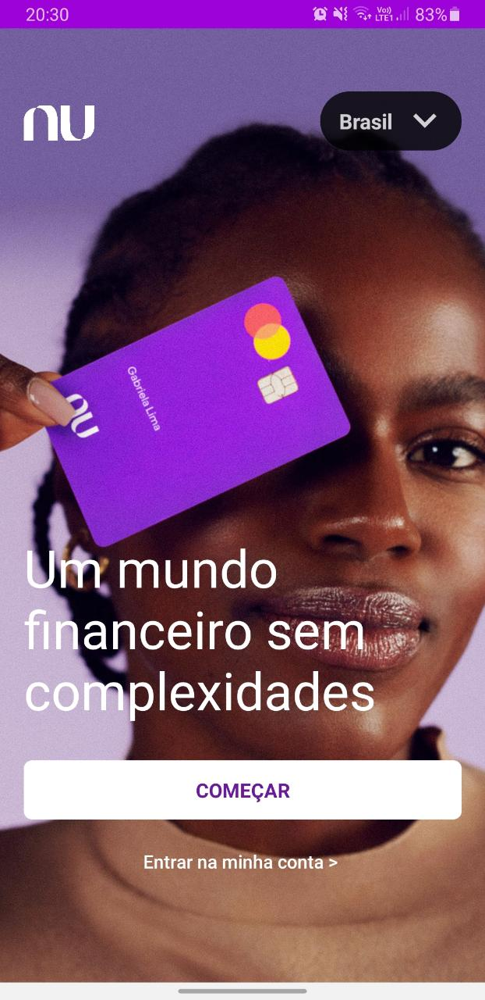
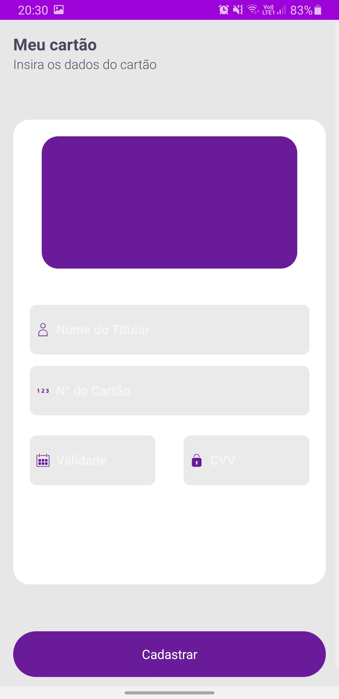

<!-- MAIN PAGE -->
 

  <h1 align="center">Nubank Clone - ReactNative</h1>
  Using TypeScript, sCss and a little bit of Animation
  

     
    <a href=""><strong>See the Project files »</strong></a>
     
     
    <a href="https://github.com/Luixs/Nubank-Clone-ReactNative/tree/master/src/assets/screensDemo">View Pages</a>
    ·
    <a href="https://www.linkedin.com/in/luis-tarlino/">Suggestions to the project</a>
    ·
    <a href="https://www.linkedin.com/in/luis-tarlino/">Who is the Luis?</a>
  

<!-- ABOUT THE PROJECT -->

  <h2>About The Project</h2>
  
  

  Project built for language studies and functions development using animation and TypeScript. Nubank is a pioneering Brazilian startup company in the financial services segment, acting as a credit card and fintech operator with operations in Brazil, all image and layout rights belong to them.
  
(<a href="#top">Back to Top!</a>)

[product-screenshot]: src/assets/screensDemo/TelaInicial.jpeg
